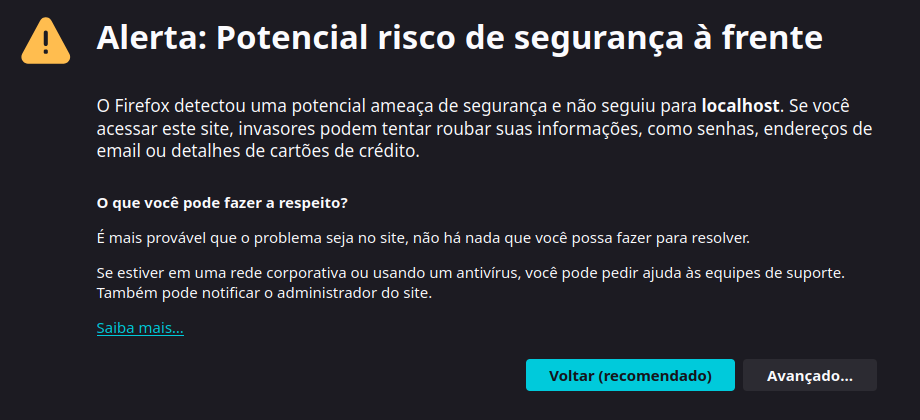
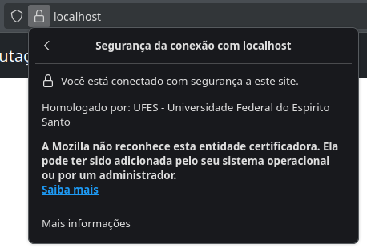

# <center> Relatório do Trabalho T1 </center>
## <center>  Segurança em Computação – 2025/2 
## <center> Infraestrutura de Certificação Digital: Let's Encrypt e PKI Própria

---

### Informações do Grupo
- **Disciplina:** Segurança em Computação 2025/2
- **Integrantes:**  
  - Nome: Diogo Delazare Brandão  
  - Nome: Jullie de Castro Quadros
  - Nome: _____________  

---

## 1. Arquitetura do Ambiente
Descreva e desenhe (use figuras) a arquitetura geral dos dois cenários implementados, destacando suas diferenças principais:

- **Cenário 1:** Let's Encrypt + ngrok — uso de uma autoridade certificadora pública para emissão automática de certificados válidos por meio do protocolo ACME.  
- **Cenário 2:** PKI própria (Root + Intermediária) — criação e operação de uma infraestrutura de chaves públicas local, com emissão de certificados assinados por uma CA interna.

---

## 2. Tarefa 1 – HTTPS com Certificado Público (Let's Encrypt + ngrok)

### 2.1. Preparação do Ambiente
- Sistema operacional: ____________________  
- Ferramentas utilizadas: ____________________  
- Versão do Docker / Nginx: ____________________  
- Descreva e disponibilize a configuração do servidor web e a página de exemplo criada:

### 2.2. Exposição com ngrok
- Domínio público gerado: ______________________________  
- Explique como o túnel foi utilizado para permitir a validação do domínio pelo Let's Encrypt.

### 2.3. Emissão do Certificado
- Caminho do certificado gerado: _________________________  
- Explique o processo de validação e emissão e quais arquivos foram gerados.

### 2.4. Configuração HTTPS no Nginx
- Descreva como foi feita a configuração do servidor para uso do certificado emitido.

### 2.5. Resultados e Validação
- URL de acesso: ______________________________  
- Screenshot da página HTTPS: *(inserir imagem)*  
- Resultado do comando de verificação: ______________________________  
- Screenshot do certificado no navegador (cadeado): *(inserir imagem)*  

---

## 3. Tarefa 2 – HTTPS com PKI Própria (Root + Intermediária)

Para esta tarefa, uma série de arquivos de script .sh foram criados por comodidade no diretório ```task_2/scripts```.
Esses scripts são usados para gerar pares de chave RSA, gerar pedidos de assinatura de certificados (CSRs) e assinat esses pedidos.

Todas as operações usam o pacote de código aberto OpenSSL, e cada script criado tem comentários descrevendo sua função e uso.
### 3.1. Criação da CA Raiz
Uma CA (Autoridade Certificadora, do inglês **Certifying Authority**) é uma entidade responsável por emitir certificados digitais que atestam a autenticidade de chaves públicas de servidores, clientes, ou outras CAs. De maneira simples, é uma entidade digital que te diz em quem você pode ou não confiar.

Quando uma CA assina um certificado digital, ela está afirmando que o dono da chave pública referente àquele certificado é confiável. Uma CA pode também ser autoassinada, o que indica que ela mesma assinou seu certificado, e não há outra CA acima dela em uma cadeia de confiança.

Quando uma CA (CA raiz) certifica outra CA (CA intermediária) é criada uma **cadeia de confiança**. A ideia básica é: "Se Fulano é confiável e Fulano confia em Beltrano, então Beltrano é confiável".

Ao acessar um site na internet via HTTPS, por exemplo, um navegador de internet recebe o certificado do site e vê que ele foi assinado por "A". Juntamente ao certificado do site, o navegador também recebe o certificado de "A", e vê que foi assinado por "B", que por sua vez foi assinado por "C", e assim por diante. Caso em algum ponto dessa cadeia de certificados o navegador encontre uma CA que considera confiável, ele passará a confiar nos certificados nos níveis inferiores da cadeia. Caso contrário, ele mostrará um alerta de que o site não é seguro.

Para criar uma CA raíz, basta executar o script ```./task_2/scripts/gen_selfsigned_CA.sh``` e informar as credenciais de identificação da CA:
``` SHELL
./task_2/scripts/gen_selfsigned_CA.sh
```
> Outra opção é executar o script ./task_2/scripts/auto_gen_selfsigned_CA.sh para criar a CA raíz com valores padrão, sem ter que informar valores.

Isso criará a chave privada da CA raíz em ```task_2/keys/CA.key``` e o seu certificado autoassinado em ```task_2/certs/CA.crt```. Usando esses dois arquivos, vamos certificar uma CA intermediária.

### 3.2. Criação da CA Intermediária
A CA intermediária (secundária) deve ser certificada por outra CA (raíz), criando a cadeia de confiança. Mas por que criar uma CA secundária ao invés de só usar a CA raíz? A vantagem dessa abordagem é que várias entidades podem ter sua confiança verificada confiando apenas em uma única CA raíz. Quanto menos CAs autoassinadas existirem, mais fácil é assegurar que cada uma delas é confiável.

Outra antagem é que se em algum momento alguma CA que tenha emitido diversos certificados se tornar insegura, é possível revogar a confiança em todos os certificados emitidos por ela apenas revogando seu próprio certificado.

Para criar uma CA intermediária, basta executar o script ```./task_2/scripts/gen_intermediate_CA.sh``` e informar as credenciais de identificação da CA:
```
./task_2/scripts/gen_intermediate_CA.sh
```
> Outra opção é executar o script ./task_2/scripts/auto_gen_intermediate_CA.sh para criar a CA intermediária com valores padrão, sem ter que informar valores.

Isso criará a chave privada da CA intermediária em ```task_2/keys/int_CA.key``` e um pedido de assinatura (CSR, do inglês **Certificate Signing Request**, ou "pedido de assinatura de certificado") em ```task_2/reqs/int_CA.crt```.

Diferente da CA raíz, a CA intermediária não assina seu próprio certificado, invés disso ela cria um CSR que deve ser assinado pela CA raíz.

Para assinar o certificado da CA intermediária usando CA raíz, basta executar o script ```task_2/scripts/sign_intermediate_CA.sh```.
``` SHELL
./task_2/scripts/sign_intermediate_CA.sh
```
Esse script usa algumas configurações adicionais no arquivo ```task_2/scripts/intermediate.cnf``` para especificar que o certificado assinado é de uma CA, e que esta CA pode usar este certificado para assinar outros certificados.


### 3.3. Emissão do Certificado do Servidor
Vamos agora criar um CSR para um servidor. O processo é parecido com o da criação da CA intermediária, exceto que quem assinará o certificado do certidor agora será a CA intermediária, e não a CA raíz.


Para criar um CSR do servidor, basta executar o script ```./task_2/scripts/gen_server_CSR.sh``` e informar as credenciais de identificação do servidor:
``` SHELL
./task_2/scripts/gen_server_CSR.sh
```
> Outra opção é executar o script ./task_2/scripts/auto_gen_server_CSR.sh para criar a o CSR do servidor com valores padrão, sem ter que informar valores.

Isso criará a chave privada do servidor em ```task_2/keys/server.key``` e um pedido de assinatura (CSR) em ```task_2/reqs/server.crt```.

Agora, vamos usar as credenciais da CA secundária para assinar o certificado do servidor. Para isso, use o script ```task_2/scripts/sign_server_CSR.sh```
``` SHELL
task_2/scripts/sign_server_CSR.sh
```
Esse script usa algumas configurações do arquivo ```task_2/scripts/v3.ext``` para incluir no certificado informações sobre os domínios válidos para aquele certificado.

Um detalhe importante é o seguinte: meu navegador de internet será configurado para confiar apenas na CA raíz, e não na CA intermediária, porém o servidor foi certificado pela CA intermediária.

Através do certificado do servidor, o navegador deve ser capaz de verificar que o mesmo foi certificado por alguma CA confiável (nesse caso, a CA raíz) em algum ponto da cadeia de confiança. Para isso, devemos enviar para o navegador não apenas o certificado do servidor, mas toda a cadeia de certificados até uma CA raíz confiável.

Isso é feito simplesmente concatenando o certificado do servidor (assinado pela CA intermediária) com o certificado da CA intermediária (assinado pela CA raíz). Se a cadeia de certificações fosse maior, todos os certificados intermediários deveriam ser enviados juntos.

O script ```task_2/scripts/sign_server_CSR.sh``` já realiza essa concatenação automaticamente na última linha, gerando o arquivo ```task_2/certs/server.chained.sh```. Inspecione este arquivo para ver que ele é formado simplesmente por dois certificados concatenados, o segundo sendo o certificado da CA intermediária.

### 3.4. Importação da CA Raiz no Navegador
Vamos agora criar nosso servidor de teste local, configurado para responder ao protocolo HTTPS. Para isso, navegue até a pasta ```task_2/docker/``` e execute o container docker:
``` SHELL
cd task_2/docker
docker-compose up -d
```
>Nota: é necessário que o docker e docker-compose estejam instalados e que o daemon docker esteja rodando no sistema.

>Nota: Talvez seja necessário executar o comando ```docker-compose up -d``` como administrador, ou sudo

Com o servidor local rodando, abra um navegador de internet e acesse a URL ```localhost```.

Você provavelmente se deparou com um aviso do tipo "Alerta: Potencial risco de segurança à frente", sinalizando que o servidor não tem um certificado SSL válido.

Por que isso aconteceu se nós acabamos de criar e assinar um certificado válido para esse servidor?

A respota é bem simples: o navegador de internet não confia na nossa CA raíz. Seria muito perigoso se qualquer navegador confiasse automaticamente em qualquer CA autoassinada, então os navegadores de interenet normalmente tem uma lista própria de CAs confiáveis, da qual nossa CA recém-criada obviamente não faz parte.

Para resolver isso, o último passo é adicionar nossa CA raíz à lista de CAs confiáveis do navegador. O processo varia um pouco de acordo com o navegador. A seguir estão as instruções para o Mozilla Firefox, mas o processo é bem semelhante em outros navegadores:

- Abra a página de configurações do navegador
- Abra a sessão "Privacidade e Segurança"
- Navegue até a sessão "Certificados"
- Clique no botão "Ver certificados..."
- Clique em "Importar..."
- Escolha o arquivo ```task_2/certs/CA.crt``` (certificado da CA raíz)
- Marque as duas opções
- Clique em "OK"

Feito isso, abra novamente a URL "localhost"

### 3.5. Validação da Cadeia
Como podemos ver, agora o navegador reconhece o site como seguro:



Repare o aviso que diz que a Mozilla não reconhece esta CA. De fato, ela foi adicinada por nós mesmos.

---

## 4. Comparação entre os Dois Cenários
Responda às questões abaixo com base na experiência prática:

- Quais as principais diferenças entre o uso de certificados públicos e privados?  
- Em quais cenários cada abordagem é mais adequada?  
- Por que a importação da CA raiz é necessária no segundo cenário?  

---

## 5. Conclusões
- Apresente as principais lições aprendidas durante o projeto.  
- Explique a importância prática da certificação digital e da confiança em ambientes seguros.

---

## Checklist Final
| Item | Status |
|------|--------|
| Servidor Nginx funcional (Docker) | ✅ / ❌ |
| Certificado Let's Encrypt emitido e válido | ✅ / ❌ |
| PKI própria criada (Root + Intermediária) | ✅  |
| Importação da CA raiz no navegador | ✅  |
| Cadeia de certificação validada com sucesso | ✅  |
| Relatório completo e entregue | ✅ / ❌ |
| Apresentação prática (vídeo) | ✅ / ❌ |

---


