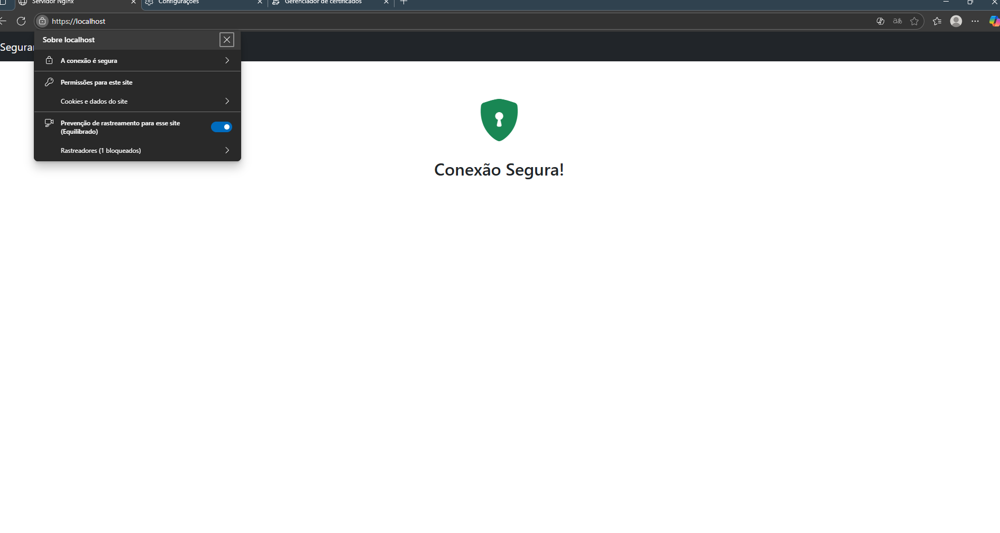
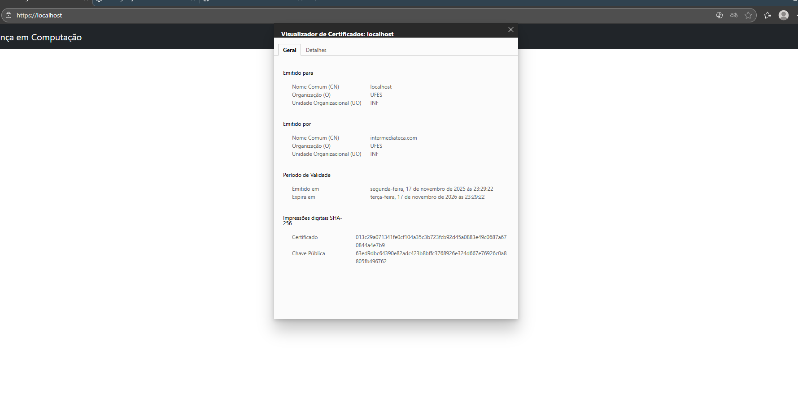

# <center> Relatório do Trabalho T1 </center>
## <center>  Segurança em Computação – 2025/2 
## <center> Infraestrutura de Certificação Digital: Let's Encrypt e PKI Própria

---

### Informações do Grupo
- **Disciplina:** Segurança em Computação 2025/2
- **Integrantes:**  
  - Nome: Diogo Delazare Brandão  
  - Nome: Jullie de Castro Quadros
  - Nome: Thyago Vieira Piske

---

**Link para o vídeo da apresentação prática:**
[clique aqui](https://drive.google.com/file/d/15ZltQ1VlpE2-zkkFxgv3K4C4un2eE3w_/view?usp=sharing)

---


## 1. Arquitetura do Ambiente
O projeto implementou e comparou duas arquiteturas de **Infraestrutura de Chaves Públicas (PKI) Privada**. Ambas têm o mesmo objetivo final: emitir um certificado HTTPS válido para um servidor Nginx local (rodando em `localhost`) usando uma hierarquia de confiança (CA Raiz e CA Intermediária) criada por nós.

O modelo de confiança em ambos os cenários é **privado**. Isso significa que a CA Raiz que criamos não é confiavel por padrão pelos navegadores. Para validar o cadeado HTTPS, é uma etapa obrigatória que o cliente (navegador) importe manualmente o certificado da CA Raiz (`CA.pem`) em sua lista de autoridades confiáveis.

As duas arquiteturas implementadas (Tarefa 1 e Tarefa 2) diferem principalmente na ferramenta e no método de emissão do certificado:

### Cenário 1: PKI com Simulação de Validação ACME (Python - Tarefa 1)
Nesta arquitetura, todo o ciclo de vida da PKI (criação da CA Raiz, Intermediária e emissão de certificados) é gerenciado por scripts Python que utilizam a biblioteca `cryptography`.

* **Componentes:** Scripts Python (`pki_manager.py`), Nginx (em Docker), pasta `challenges` (usada para validação).
* **Fluxo de Emissão:** Este cenário simula o protocolo ACME (HTTP-01) usado pelo Let's Encrypt:
    1.  O administrador executa `init-root-ca` e `init-intermediate-ca` (tarefa única).
    2.  O administrador executa `generate-challenge localhost`. O script Python (agindo como a CA) gera um token secreto.
    3.  O administrador (agindo como dono do servidor) cria manualmente o arquivo de desafio (`.well-known/acme-challenge/<token>.txt`) no diretório `challenges`, que é servido pelo Nginx na porta 80.
    4.  O administrador executa `issue-certificate localhost`. O script Python (CA) agora faz uma requisição HTTP ao servidor Nginx para validar o token.
    5.  Se a validação for bem-sucedida, o script emite o certificado final para o `localhost`.
* **Diferencial:** A validação é *automatizada* (a CA verifica ativamente o controle do servidor) e se assemelha a um processo de CA pública moderno.

### Cenário 2: PKI com Scripts OpenSSL (Bash - Tarefa 2)
Nesta arquitetura, o mesmo ciclo de vida da PKI é gerenciado por scripts Bash (`.sh`) que encapsulam comandos diretos da ferramenta `openssl`.

* **Componentes:** Scripts Bash (`.sh`), `openssl` (instalado no sistema), Nginx (em Docker).
* **Fluxo de Emissão:** Este cenário segue o fluxo *manual* tradicional de uma PKI:
    1.  O administrador executa scripts para gerar as CAs (`gen_selfsigned_CA.sh`, `gen_intermediate_CA.sh`).
    2.  O administrador executa um script para gerar uma Chave Privada e um Pedido de Assinatura de Certificado (CSR) para o servidor (`gen_server_CSR.sh`).
    3.  O administrador (agindo como a CA) recebe o CSR e usa um script para *assinar* manualmente esse pedido usando a CA Intermediária (`sign_server_CSR.sh`).
    4.  O certificado final é gerado e instalado no Nginx.
* **Diferencial:** O processo é *manual* e baseado em confiança administrativa. O "dono do servidor" e a "CA" são a mesma pessoa (o administrador), que assina os certificados sem uma verificação de desafio HTTP.
---

## 2. Tarefa 1 – HTTPS com Certificado Válido via CA Privada (Root + Intermediária) usando Python

### 2.1. Preparação do Ambiente
- **Sistema operacional:** Wsl (Ubuntu 22.04 LTS) no Windows 11.
- **Ferramentas utilizadas:** Python 3, Docker, Nginx, biblioteca `cryptography` (Python).
- **Versão do Docker / Nginx:** Docker 27.2.0, Imagem Nginx: `nginx:latest`
  O servidor web utiliza Nginx rodando em um container Docker, orquestrado pelo `docker-compose.yml`.
  A configuração inicial (`nginx.conf`) escuta apenas na porta 80 (HTTP) e possui duas rotas:
  1.  `location /`: Serve a página `index.html` padrão.
  2.  `location /.well-known/acme-challenge/`: Rota para a validação de domínio (desafio HTTP-01).
  
  O `docker-compose.yml` mapeia os volumes:
  * `./index.html` -> Página web principal.
  * `./nginx.conf` -> Arquivo de configuração do Nginx.
  * `../challenges` -> Diretório no host que o Nginx servirá como a rota de desafio (`/var/www/challenges` no container).
  **Importante**: Considere que root é a pasta task_1.

### 2.2. Simulação de Validação
- **Domínio público gerado:** N/A. O teste foi realizado inteiramente em ambiente local usando o domínio `localhost`.

O processo simulou o protocolo ACME (usado pelo Let's Encrypt):
#### 2.2.1. Criar CA Raiz
  ```bash
  python pki_manager.py init-root-ca
  ```

  Cria `certs/CA.pem` e `keys/CA.key` (RSA 4096 bits, autoassinado).

  Parâmetros opcionais:
  - `--common-name` (default `rootca.com`)
  - `--organization` (default `UFES`)
  - `--organizational-unit` (default `CT`)
  - `--country` (default `BR`)
  - `--locality` (default `Vitoria`)
  - `--state` (default `ES`)
  - `--validity-days` (default `365`)

    
#### 2.2.2. Criar CA Intermediária

```bash
python pki_manager.py init-intermediate-ca
```

Cria `certs/intermediate_CA.pem` e `keys/intermediate_CA.key` (RSA 4096 bits, assinado pela Raiz).

Parâmetros opcionais:
- `--common-name` (default `intermediateca.com`)
- `--organization` (default `UFES`)
- `--organizational-unit` (default `INF`)
- `--country` (default `BR`)
- `--locality` (default `Vitoria`)
- `--state` (default `ES`)
- `--validity-days` (default `365`)


#### 2.2.3. Gerar Desafio para Domínio

```bash
python pki_manager.py generate-challenge localhost
```

Gera um token (GUID), salva internamente e mostra as instruções:
- Criar arquivo `challenges/.well-known/acme-challenge/<token>.txt` no servidor 
- Conteúdo: `<token>.<domínio>`

### 2.3. Emissão do Certificado
- **Caminho do certificado gerado:** `certs/server.chained.crt` (cadeia completa) e `keys/server.key` (chave privada).
  Após o sucesso da validação descrita acima, o script `issue-certificate` procedeu com a emissão:
```bash
python pki_manager.py issue-certificate localhost
```

Valida o desafio (busca o token salvo internamente) fazendo requisição HTTP e emite o certificado se válido.

Cria:
- `certs/server.crt` - Certificado do servidor
- `certs/server.chained.crt` - Cadeia completa (server + intermediate)
- `keys/server.key` - Chave privada (RSA 4096 bits)

Parâmetros adicionais:
- `--organization` (default `UFES`)
- `--organizational-unit` (default `INF`)
- `--country` (default `BR`)
- `--locality` (default `Vitoria`)
- `--state` (default `ES`)
- `--validity-days` (default `365`)

#### 2.3.1. Detalhes da Validação do Desafio

A CA armazena os desafios pendentes em `certs/challenges.json`.

Quando você executa `issue-certificate`, a CA:
1. Busca o token que ela gerou para aquele domínio
2. Faz requisição GET para: `http://<domínio>/.well-known/acme-challenge/<token>.txt`
3. Verifica se o conteúdo é: `<token>.<domínio>`
4. Emite o certificado se válido

Simula o protocolo ACME HTTP-01 do Let's Encrypt.

### 2.4. Configuração HTTPS no Nginx
**IMPORTANTE:** Os arquivos já vêm configurados para iniciar apenas com HTTP. As linhas de certificado e o bloco HTTPS estão comentados.
  
1. **Inicie o servidor:**
```bash
cd docker
docker-compose up -d
```
O servidor inicia apenas com HTTP (porta 80) para servir os desafios.
2. **Após emitir o certificado**, descomente as linhas no `docker/docker-compose.yml`:
```yaml
# - ../certs/server.chained.crt:/etc/nginx/ssl/server.chained.crt
# - ../keys/server.key:/etc/nginx/ssl/server.key
```

E descomente o bloco HTTPS no `docker/nginx.conf`, depois reinicie:
```bash
docker-compose restart
```
Acessa `https://localhost` após emitir o certificado (importar `certs/CA.pem` no navegador primeiro).

### 2.5. Resultados e Validação
- **URL de acesso:** `https://localhost`
- **Screenshot da página HTTPS:** 
  
- **Resultado do comando de verificação:** Use `openssl verify` para verificar a cadeia de certificação:
  ```bash
  openssl verify -CAfile certs/CA.pem -untrusted certs/intermediate_CA.pem certs/server.chained.crt
  ```
  O comando deve retornar `OK` se a hierarquia estiver correta.
- **Screenshot do certificado no navegador (cadeado):**
  

### 2.6. Resumo dos Comandos Utilizados
- `init-root-ca` - Cria CA Raiz
- `init-intermediate-ca` - Cria CA Intermediária  
- `generate-challenge <domain>` - Gera e salva token de validação
- `issue-certificate <domain>` - Valida token e emite certificado

### 2.7. Resumo do fluxo:
```bash
# 1. Setup das CAs
python pki_manager.py init-root-ca
python pki_manager.py init-intermediate-ca

# 2. Gerar desafio (CA salva o token internamente)
python pki_manager.py generate-challenge localhost

# 3. No servidor, criar arquivo:
# challenges/.well-known/acme-challenge/<token>.txt
# com conteúdo: <token>.localhost

# 4. Emitir certificado (CA valida o token que ela gerou)
python pki_manager.py issue-certificate localhost
```
---

## 3. Tarefa 2 – HTTPS com PKI Própria (Root + Intermediária)

Para esta tarefa, uma série de arquivos de script .sh foram criados por comodidade no diretório ```task_2/scripts```.
Esses scripts são usados para gerar pares de chave RSA, gerar pedidos de assinatura de certificados (CSRs) e assinat esses pedidos.

Todas as operações usam o pacote de código aberto OpenSSL, e cada script criado tem comentários descrevendo sua função e uso.
### 3.1. Criação da CA Raiz
Uma CA (Autoridade Certificadora, do inglês **Certifying Authority**) é uma entidade responsável por emitir certificados digitais que atestam a autenticidade de chaves públicas de servidores, clientes, ou outras CAs. De maneira simples, é uma entidade digital que te diz em quem você pode ou não confiar.

Quando uma CA assina um certificado digital, ela está afirmando que o dono da chave pública referente àquele certificado é confiável. Uma CA pode também ser autoassinada, o que indica que ela mesma assinou seu certificado, e não há outra CA acima dela em uma cadeia de confiança.

Quando uma CA (CA raiz) certifica outra CA (CA intermediária) é criada uma **cadeia de confiança**. A ideia básica é: "Se Fulano é confiável e Fulano confia em Beltrano, então Beltrano é confiável".

Ao acessar um site na internet via HTTPS, por exemplo, um navegador de internet recebe o certificado do site e vê que ele foi assinado por "A". Juntamente ao certificado do site, o navegador também recebe o certificado de "A", e vê que foi assinado por "B", que por sua vez foi assinado por "C", e assim por diante. Caso em algum ponto dessa cadeia de certificados o navegador encontre uma CA que considera confiável, ele passará a confiar nos certificados nos níveis inferiores da cadeia. Caso contrário, ele mostrará um alerta de que o site não é seguro.

Para criar uma CA raíz, basta executar o script ```./task_2/scripts/gen_selfsigned_CA.sh``` e informar as credenciais de identificação da CA:
``` SHELL
./task_2/scripts/gen_selfsigned_CA.sh
```
> Outra opção é executar o script ./task_2/scripts/auto_gen_selfsigned_CA.sh para criar a CA raíz com valores padrão, sem ter que informar valores.

Isso criará a chave privada da CA raíz em ```task_2/keys/CA.key``` e o seu certificado autoassinado em ```task_2/certs/CA.crt```. Usando esses dois arquivos, vamos certificar uma CA intermediária.

### 3.2. Criação da CA Intermediária
A CA intermediária (secundária) deve ser certificada por outra CA (raíz), criando a cadeia de confiança. Mas por que criar uma CA secundária ao invés de só usar a CA raíz? A vantagem dessa abordagem é que várias entidades podem ter sua confiança verificada confiando apenas em uma única CA raíz. Quanto menos CAs autoassinadas existirem, mais fácil é assegurar que cada uma delas é confiável.

Outra antagem é que se em algum momento alguma CA que tenha emitido diversos certificados se tornar insegura, é possível revogar a confiança em todos os certificados emitidos por ela apenas revogando seu próprio certificado.

Para criar uma CA intermediária, basta executar o script ```./task_2/scripts/gen_intermediate_CA.sh``` e informar as credenciais de identificação da CA:
```
./task_2/scripts/gen_intermediate_CA.sh
```
> Outra opção é executar o script ./task_2/scripts/auto_gen_intermediate_CA.sh para criar a CA intermediária com valores padrão, sem ter que informar valores.

Isso criará a chave privada da CA intermediária em ```task_2/keys/int_CA.key``` e um pedido de assinatura (CSR, do inglês **Certificate Signing Request**, ou "pedido de assinatura de certificado") em ```task_2/reqs/int_CA.crt```.

Diferente da CA raíz, a CA intermediária não assina seu próprio certificado, invés disso ela cria um CSR que deve ser assinado pela CA raíz.

Para assinar o certificado da CA intermediária usando CA raíz, basta executar o script ```task_2/scripts/sign_intermediate_CA.sh```.
``` SHELL
./task_2/scripts/sign_intermediate_CA.sh
```
Esse script usa algumas configurações adicionais no arquivo ```task_2/scripts/intermediate.cnf``` para especificar que o certificado assinado é de uma CA, e que esta CA pode usar este certificado para assinar outros certificados.


### 3.3. Emissão do Certificado do Servidor
Vamos agora criar um CSR para um servidor. O processo é parecido com o da criação da CA intermediária, exceto que quem assinará o certificado do certidor agora será a CA intermediária, e não a CA raíz.


Para criar um CSR do servidor, basta executar o script ```./task_2/scripts/gen_server_CSR.sh``` e informar as credenciais de identificação do servidor:
``` SHELL
./task_2/scripts/gen_server_CSR.sh
```
> Outra opção é executar o script ./task_2/scripts/auto_gen_server_CSR.sh para criar a o CSR do servidor com valores padrão, sem ter que informar valores.

Isso criará a chave privada do servidor em ```task_2/keys/server.key``` e um pedido de assinatura (CSR) em ```task_2/reqs/server.crt```.

Agora, vamos usar as credenciais da CA secundária para assinar o certificado do servidor. Para isso, use o script ```task_2/scripts/sign_server_CSR.sh```
``` SHELL
task_2/scripts/sign_server_CSR.sh
```
Esse script usa algumas configurações do arquivo ```task_2/scripts/v3.ext``` para incluir no certificado informações sobre os domínios válidos para aquele certificado.

Um detalhe importante é o seguinte: meu navegador de internet será configurado para confiar apenas na CA raíz, e não na CA intermediária, porém o servidor foi certificado pela CA intermediária.

Através do certificado do servidor, o navegador deve ser capaz de verificar que o mesmo foi certificado por alguma CA confiável (nesse caso, a CA raíz) em algum ponto da cadeia de confiança. Para isso, devemos enviar para o navegador não apenas o certificado do servidor, mas toda a cadeia de certificados até uma CA raíz confiável.

Isso é feito simplesmente concatenando o certificado do servidor (assinado pela CA intermediária) com o certificado da CA intermediária (assinado pela CA raíz). Se a cadeia de certificações fosse maior, todos os certificados intermediários deveriam ser enviados juntos.

O script ```task_2/scripts/sign_server_CSR.sh``` já realiza essa concatenação automaticamente na última linha, gerando o arquivo ```task_2/certs/server.chained.sh```. Inspecione este arquivo para ver que ele é formado simplesmente por dois certificados concatenados, o segundo sendo o certificado da CA intermediária.

### 3.4. Importação da CA Raiz no Navegador
Vamos agora criar nosso servidor de teste local, configurado para responder ao protocolo HTTPS. Para isso, navegue até a pasta ```task_2/docker/``` e execute o container docker:
``` SHELL
cd task_2/docker
docker-compose up -d
```
>Nota: é necessário que o docker e docker-compose estejam instalados e que o daemon docker esteja rodando no sistema.

>Nota: Talvez seja necessário executar o comando ```docker-compose up -d``` como administrador, ou sudo

Com o servidor local rodando, abra um navegador de internet e acesse a URL ```localhost```.

Você provavelmente se deparou com um aviso do tipo "Alerta: Potencial risco de segurança à frente", sinalizando que o servidor não tem um certificado SSL válido.

Por que isso aconteceu se nós acabamos de criar e assinar um certificado válido para esse servidor?

A respota é bem simples: o navegador de internet não confia na nossa CA raíz. Seria muito perigoso se qualquer navegador confiasse automaticamente em qualquer CA autoassinada, então os navegadores de interenet normalmente tem uma lista própria de CAs confiáveis, da qual nossa CA recém-criada obviamente não faz parte.

Para resolver isso, o último passo é adicionar nossa CA raíz à lista de CAs confiáveis do navegador. O processo varia um pouco de acordo com o navegador. A seguir estão as instruções para o Mozilla Firefox, mas o processo é bem semelhante em outros navegadores:

- Abra a página de configurações do navegador
- Abra a sessão "Privacidade e Segurança"
- Navegue até a sessão "Certificados"
- Clique no botão "Ver certificados..."
- Clique em "Importar..."
- Escolha o arquivo ```task_2/certs/CA.crt``` (certificado da CA raíz)
- Marque as duas opções
- Clique em "OK"

Feito isso, abra novamente a URL "localhost"

### 3.5. Validação da Cadeia
Como podemos ver, agora o navegador reconhece o site como seguro:


Repare o aviso que diz que a Mozilla não reconhece esta CA. De fato, ela foi adicinada por nós mesmos.

O script ```./task_2/scripts/cleanup.sh``` pode ser usado para excluir automaticamente todas os arquivos de chaves, CSRs e certificados gerados durante o processo.

## 4. Comparação entre os Dois Cenários
Responda às questões abaixo com base na experiência prática:

- **Quais as principais diferenças entre o uso de certificados públicos e privados?** 
  - **Confiança:** Públicos são confiáveis por padrão em todos os navegadores. Privados exigem que a CA Raiz seja instalada manualmente em cada cliente.
  - **Validação:** Públicos exigem prova de controle de um domínio na internet (via HTTP, DNS, etc.). Privados são usados para entidades internas (`localhost`) sem validação pública.
  - **Custo:** Públicos podem ser gratuitos (Let's Encrypt) ou pagos. Privados não têm custo de emissão, mas exigem manutenção da infraestrutura da PKI.

- **Em quais cenários cada abordagem é mais adequada?** 
  - **Certificados Públicos:** Essenciais para serviços públicos na internet (sites, APIs, lojas virtuais) que precisam de confiança imediata do público.
  - **Certificados Privados:** Ideais para ambientes internos (intranet), testes (`localhost`), VPNs e comunicação segura entre microsserviços.

- **Por que a importação da CA raiz é necessária no segundo cenário?** 
  - O navegador possui uma lista interna de CAs confiáveis. Nossa CA privada não está nessa lista. A importação manual do `CA.pem` adiciona nossa CA a essa lista, permitindo que o navegador valide a cadeia de confiança (Raiz -> Intermediária -> Servidor).

---

## 5. Conclusões
- **Apresente as principais lições aprendidas durante o projeto.** 
  - O projeto demonstrou na prática como funciona a "cadeia de confiança" (Raiz -> Intermediária -> Servidor). Vimos que certificados são atestados de identidade digital e aprendemos a importância de usar CAs Intermediárias para proteger a chave Raiz. Também simulamos o protocolo ACME (HTTP-01), entendendo como a validação de domínio é automatizada.

- **Explique a importância prática da certificação digital e da confiança em ambientes seguros.**
  - A certificação digital é o pilar da confiança na web. Ela garante dois pontos cruciais:
    1. **Autenticidade:** Prova que o servidor é quem diz ser (evitando impostores).
    2. **Confidencialidade:** Permite a criptografia (HTTPS), protegendo os dados contra interceptação (ataques *man-in-the-middle*).
  - Sem ela, transações financeiras e logins online não seriam seguros.
---

## Checklist Final
| Item | Status |
|------|--------|
| Servidor Nginx funcional (Docker) | ✅  |
| HTTPS com Certificado Válido via CA Privada (Root + Intermediária) usando Python |  ✅  |
| PKI própria criada (Root + Intermediária) | ✅  |
| Importação da CA raiz no navegador | ✅  |
| Cadeia de certificação validada com sucesso | ✅  |
| Relatório completo e entregue | ✅  |
| Apresentação prática (vídeo) | ✅ |

---


